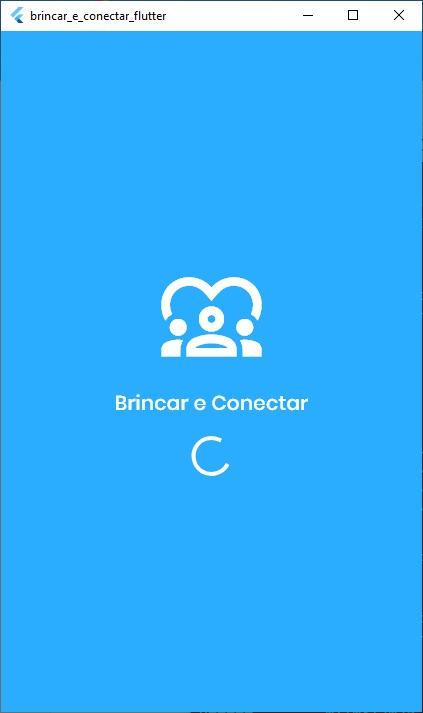
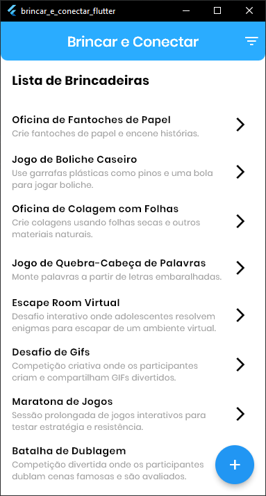
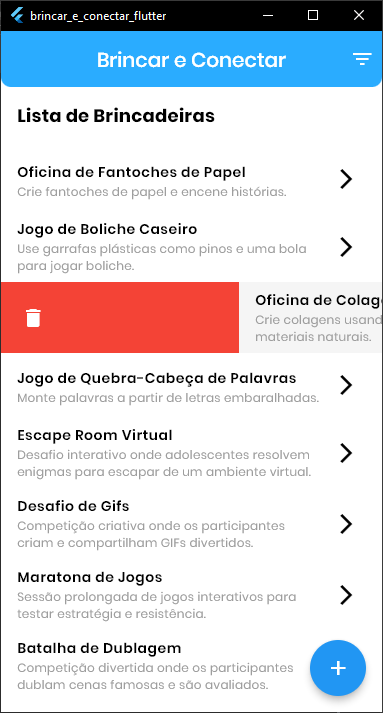
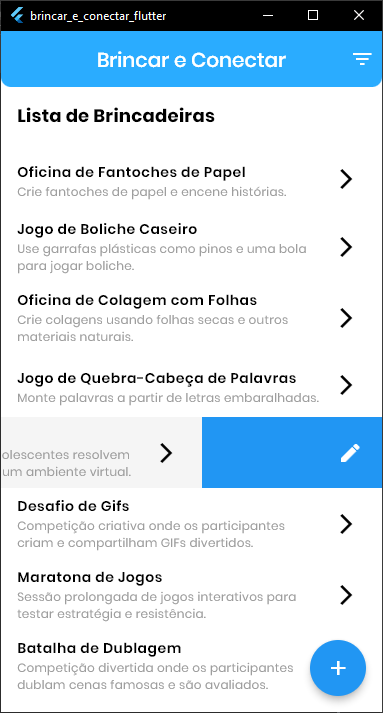
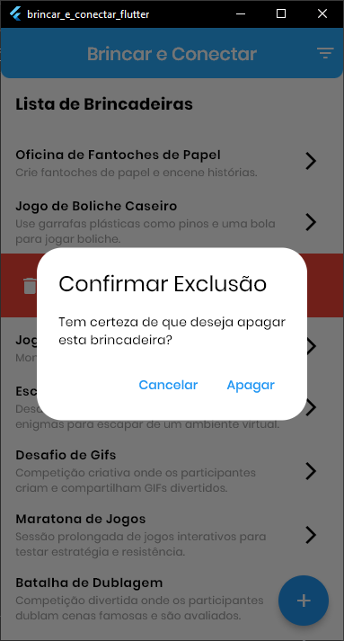
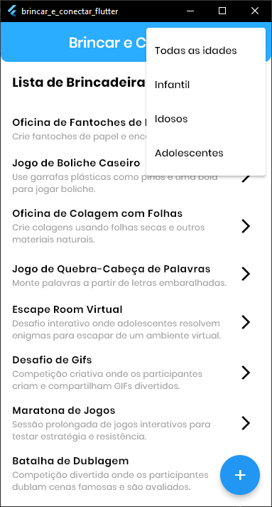

## 📱 Aplicativo Mobile - Brincar e Conectar

O **Brincar e Conectar** é um aplicativo Flutter desenvolvido para instituições como asilos e orfanatos, com foco inicial em Guarulhos, SP. Seu objetivo é fornecer aos profissionais e representantes acesso rápido a uma lista de brincadeiras de baixo custo, organizadas por faixa etária (crianças, adolescentes e idosos).

O app possui uma interface simples e direta, iniciando com uma splash screen e indo diretamente para a lista de atividades.

### 🔑 Principais funcionalidades do App

- Navegar por uma lista de brincadeiras
- Filtrar por faixa etária (Crianças, Adolescentes, Idosos)
- Visualizar detalhes completos de cada brincadeira
- Adicionar novas atividades
- Editar atividades existentes
- Excluir atividades (com gesto de swipe)

### 🧰 Tecnologias utilizadas no app

- **Flutter SDK**
- **flutter_bloc (Cubit)** – gerenciamento de estado
- **provider** – injeção de dependências
- **go_router** – roteamento
- **dio** – cliente HTTP
- **result_dart** – tratamento funcional de erros

### 🖼️ Imagens do aplicativo

## 👤 Autor

**Franklyn Viana dos Santos**  
📧 E-mail: franklyn_vs_@hotmail.com  
🎓 RU Uninter: 4298019  
🔗 [LinkedIn](https://www.linkedin.com/in/franklyn-v-santos/)
